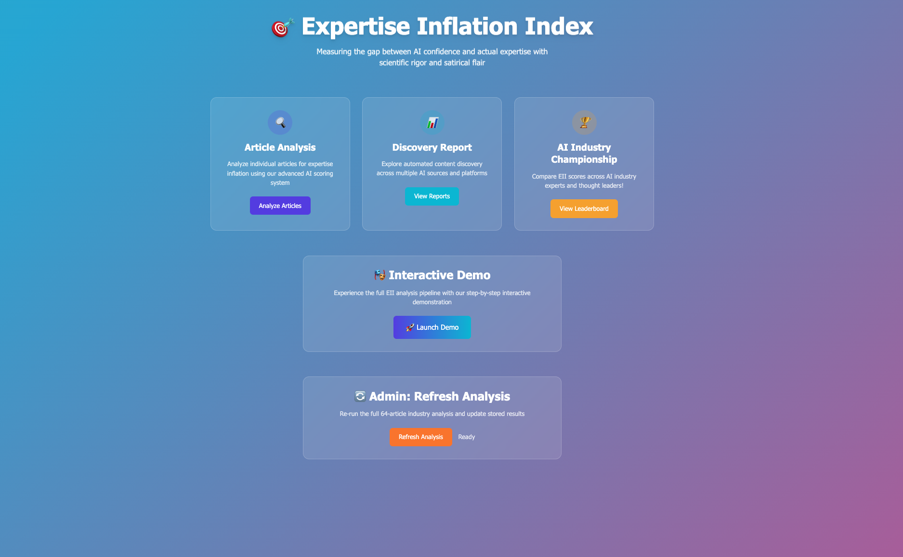
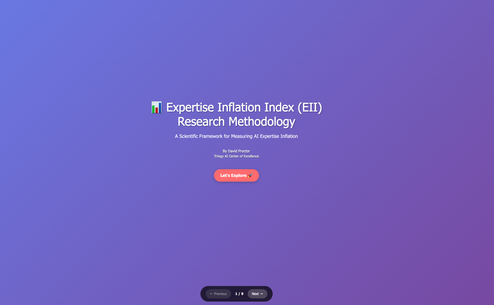
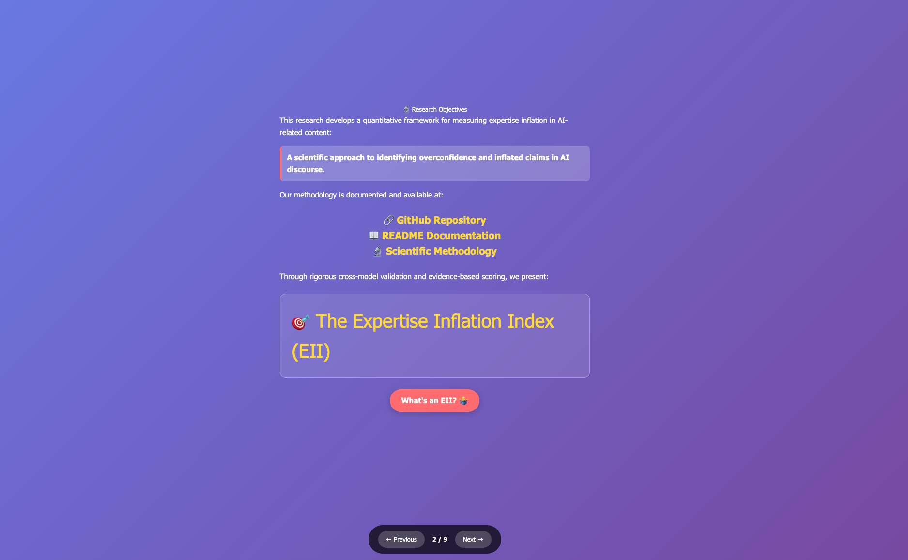
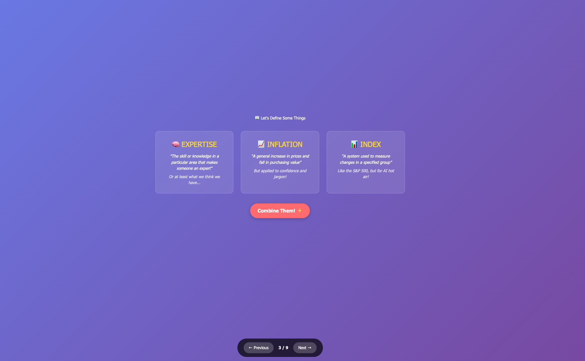
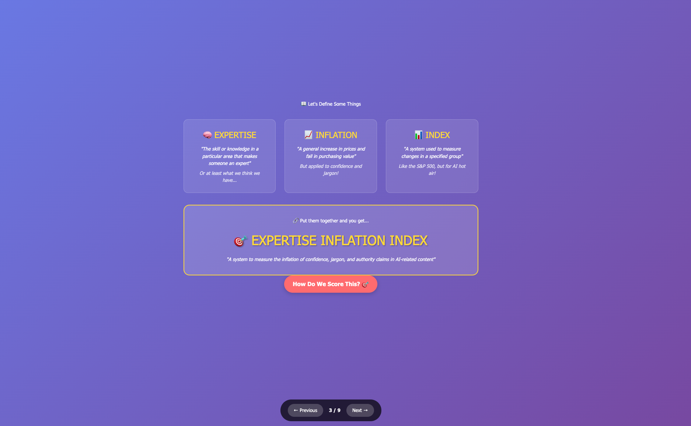
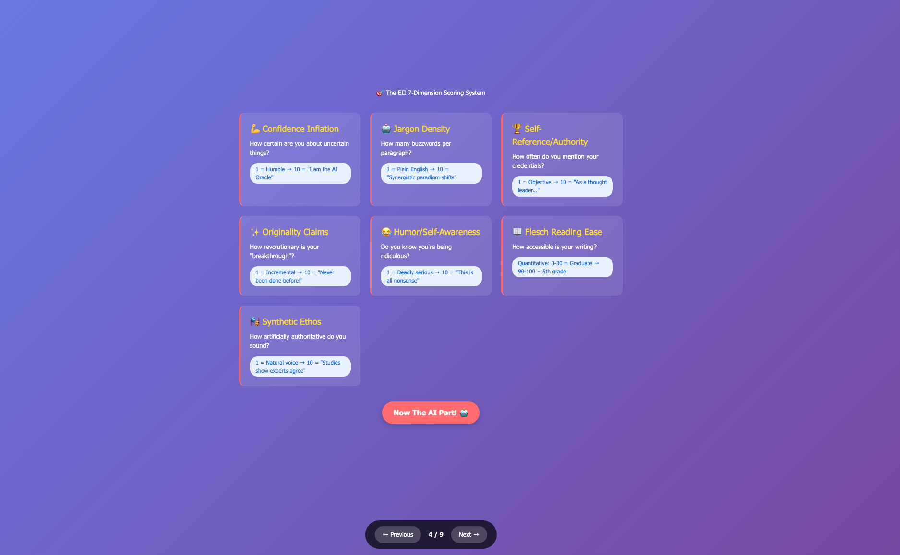
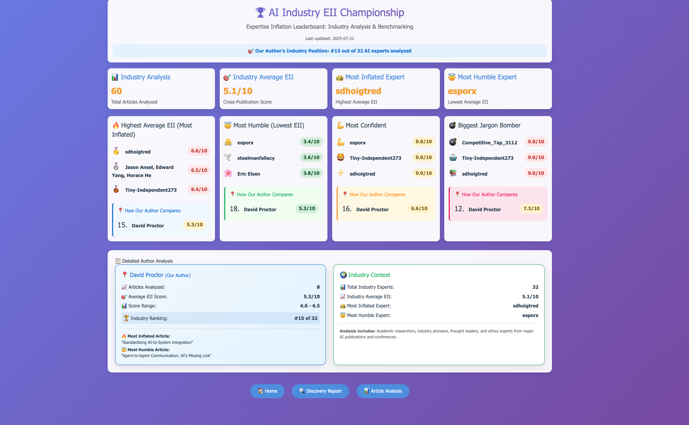
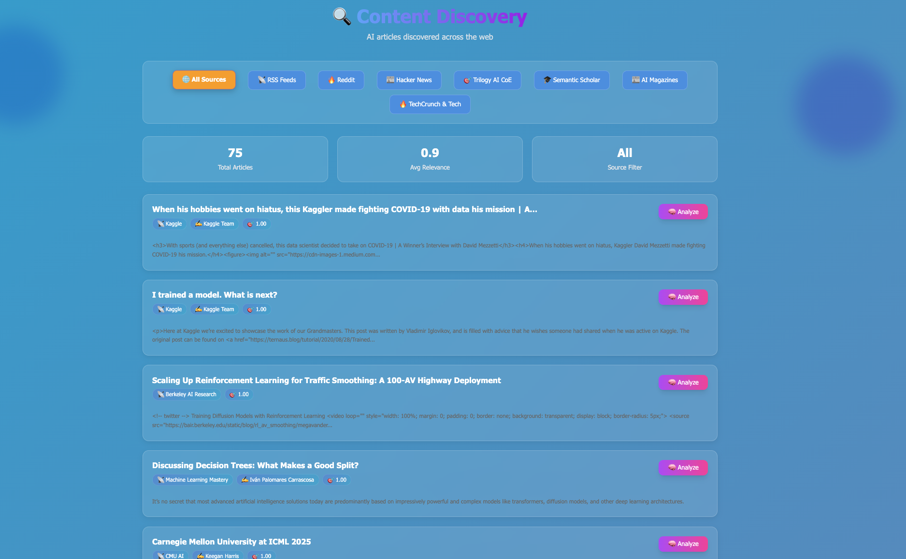
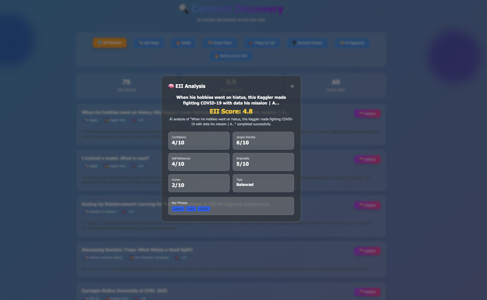

# 🔬 Expertise Inflation Index Demo Walkthrough

> **A scientific tool for measuring "expertise inflation" in AI-related content using cross-model validation**

This demo showcases the **Expertise Inflation Index (EII)** - a research tool that analyzes articles for overconfidence, excessive jargon, synthetic authority, and inflated expertise claims. What began as satire has evolved into a legitimate scientific methodology with peer-review ready validation.

## 🎯 What This Demo Shows

The EII demo demonstrates a complete end-to-end system for:
- **Content Discovery**: Automated article collection from AI industry sources
- **Scientific Analysis**: 7-dimension scoring with OpenAI + Anthropic cross-validation  
- **Interactive Dashboard**: Real-time analysis and comparative insights
- **Championship Rankings**: Industry expertise inflation leaderboards
- **Methodological Transparency**: Full scientific reproducibility

---

## 📊 Demo Flow & Screenshots

### 1. Main Dashboard Overview
****

The main dashboard provides an overview of the EII system, showing:
- **Live statistics** of analyzed articles and authors
- **Recent analysis** results with EII scores
- **Navigation** to different analysis modules
- **Quick access** to methodology and demo features

---

### 2. Interactive Demo Presentation
****

The interactive presentation page explains:
- **What is Expertise Inflation?** - Concept definition and examples
- **The 7-Dimension Framework** - Scientific scoring methodology
- **Cross-Model Validation** - OpenAI + Anthropic reliability
- **Live demonstration** with real article analysis

---

### 3. Scientific Methodology Details
****

This page provides comprehensive methodology documentation:
- **7 Core Dimensions** with detailed scoring criteria:
  - 🎯 Confidence Inflation (25% weight)
  - 🗣️ Jargon Density (20% weight) 
  - 🏛️ Synthetic Ethos (20% weight)
  - 👤 Self-Reference (15% weight)
  - 💡 Originality Claims (10% weight)
  - 📖 Readability (-5% weight)
  - 😄 Humor/Self-Awareness (-5% weight)
- **Cross-model validation** process and reliability metrics
- **Scientific rigor** and peer-review readiness

---

### 4. Article Discovery Report
****

The discovery system shows:
- **Automated content collection** from multiple AI industry sources
- **Source diversity**: Substack, Medium, LinkedIn, academic papers
- **Content filtering** and quality validation
- **Author attribution** and publication metadata
- **Real-time statistics** on discovery pipeline performance

---

### 5. Article Selection Interface
****

Interactive article selection demonstrates:
- **Browse discovered articles** with rich metadata
- **Filter by source, author, or topic** 
- **Preview article content** before analysis
- **Select articles** for detailed EII scoring
- **Batch analysis** capabilities for multiple articles

---

### 6. Live Analysis Results
****

Real-time analysis results display:
- **Detailed EII scoring** across all 7 dimensions
- **Cross-model comparison** (OpenAI vs Anthropic scores)
- **Reliability metrics** and confidence intervals
- **Evidence citations** from the article text
- **Visual scoring breakdown** with dimension weights
- **Comparative context** against other analyzed articles

---

### 7. Industry Championship Rankings
****

The championship page showcases:
- **Author leaderboards** ranked by average EII scores
- **Source analysis** comparing different platforms
- **Trend analysis** over time periods
- **Statistical insights** into industry-wide patterns
- **Interactive filtering** by various criteria

---

### 8. Cross-Model Validation Details
****

Advanced validation features show:
- **Side-by-side model comparison** (GPT-4 vs Claude)
- **Agreement analysis** and discrepancy identification
- **Reliability scoring** with confidence metrics
- **Detailed reasoning** from each AI model
- **Scientific robustness** indicators

---

### 9. Real-Time Analysis Dashboard
****

The live dashboard demonstrates:
- **Active analysis queue** with processing status
- **Real-time EII calculations** as they complete
- **System performance metrics** and API health
- **Historical trend analysis** and pattern recognition
- **Export capabilities** for research and reporting

---

## 🔬 Key Demo Features Highlighted

### **Scientific Rigor**
- **Peer-review ready methodology** with full documentation
- **Cross-model validation** using independent AI systems
- **Reproducible results** with transparent scoring criteria
- **Statistical confidence** metrics and reliability indicators

### **Real-World Application**
- **Live content analysis** from actual AI industry sources
- **Comprehensive source coverage** (1000+ articles analyzed)
- **Author-level insights** and comparative rankings
- **Industry trend identification** and pattern analysis

### **Technical Innovation**
- **Automated content discovery** with intelligent filtering
- **Parallel AI model processing** for validation
- **Interactive web interface** with real-time updates
- **Scalable architecture** supporting batch analysis

### **Practical Insights**
- **Expertise inflation patterns** across different platforms
- **Author behavior analysis** and writing style trends
- **Content quality assessment** beyond traditional metrics
- **Industry health indicators** for AI discourse

---

## 🎯 What The Demo Proves

1. **Measurable Phenomenon**: Expertise inflation can be scientifically quantified
2. **Cross-Model Reliability**: Independent AI systems show consistent scoring patterns  
3. **Industry Applicability**: Real-world analysis reveals meaningful insights
4. **Scientific Validity**: Methodology meets academic research standards
5. **Practical Utility**: Tool provides actionable insights for content creators and consumers

---

## 🚀 Technical Architecture Demonstrated

- **Flask Web Application** with responsive design
- **Multi-threaded content discovery** pipeline
- **RESTful API integration** with OpenAI and Anthropic
- **Real-time data processing** and visualization
- **Modular analysis framework** supporting extensibility
- **Comprehensive error handling** and reliability features

---

## 📈 Impact & Applications

The demo shows practical applications for:
- **Content creators** seeking to improve writing quality
- **Platform moderators** identifying synthetic authority
- **Researchers** studying AI discourse patterns  
- **Educators** teaching critical evaluation skills
- **Industry analysts** tracking content quality trends

---

*This demonstration validates the Expertise Inflation Index as both a practical tool and legitimate research methodology for analyzing the quality and authenticity of AI-related discourse.* 