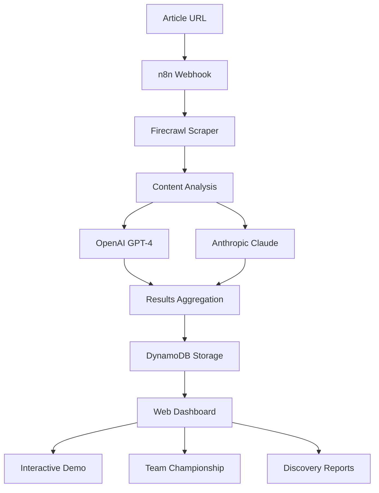

# 🧠 Expertise Inflation Index (EII)

> *"The greatest enemy of knowledge is not ignorance, it is the illusion of knowledge." - Stephen Hawking*  
> *...but sometimes that illusion is really, really funny.* 🤖

A semi-satirical, semi-scientific open-source project to analyze AI-related articles for "expertise inflation" - the tendency to exhibit overconfidence, excessive jargon, and inflated claims of expertise.

**🌐 [Live Demo](http://127.0.0.1:8080/demo)** | **📊 [Dashboard](http://127.0.0.1:8080/)** | **🔗 [Repository](https://github.com/dp-pcs/expertise-inflation-index)**

  

## 🎯 What It Does

The EII analyzes articles and scores them across five dimensions:

- **🎯 Confidence Inflation** (1-10): Overconfident claims vs. humble uncertainty
- **🗣️ Jargon Density** (1-10): Buzzword usage vs. plain language  
- **👤 Self-Reference** (1-10): Self-promotion vs. collaborative tone
- **💡 Originality Claims** (1-10): Breakthrough claims vs. incremental work
- **😄 Humor/Self-Awareness** (1-10): Self-deprecating vs. overly serious

**Overall EII Score**: Weighted average indicating how "inflated" an article's expertise claims are.

## 🚀 Quick Start

### Option 1: Interactive Demo (Recommended)
```bash
git clone https://github.com/dp-pcs/expertise-inflation-index.git
cd expertise-inflation-index
pip install -r requirements.txt
python web_dashboard.py --port 8080
```

Then visit `http://localhost:8080/demo` for an interactive presentation showing how the system works!

### Option 2: Command Line Testing
```bash
# Test the AI prompt against example articles
python test_prompt.py

# Discover articles from various sources  
python content_discovery.py --source trilogy --limit 10

# Run team analysis on Trilogy AI articles
python trilogy_team_analysis.py
```

## 🎭 The Real Engine Under the Hood

While the **Expertise Inflation Index** started as a tongue-in-cheek experiment, there's a real engine under the hood.

Behind the scenes, the system uses **n8n** to orchestrate a webhook-triggered pipeline. It kicks off with a Firecrawl scrape of a publicly available AI article, then passes the raw content into two different LLMs — one from OpenAI, one from Anthropic — for dual-model analysis. The results are combined and formatted, then stored in **DynamoDB**, ready for future queries or display.

In this demo, we score articles across humorous but revealing dimensions like **jargon density** and **self-reference count**. But with minor adjustments, this exact pipeline could serve serious, real-world use cases:

- **Marketing teams** could analyze competitor tone and audience alignment.
- **Tech bloggers** could run peer reviews for clarity, originality, and overclaiming.
- **Educators** could scan student essays or course materials for inaccessible language.
- **Content teams** could maintain consistency across technical documentation.
- **Researchers** could analyze academic papers for accessibility and bias.

To turn it into something production-ready, you'd want to:

- Add metadata like author, timestamp, and topic tags
- Replace the humor dimension with sentiment or bias scoring  
- Tune prompts for more consistent output across models
- Add a visualization layer (e.g. Supabase dashboard or n8n webhook frontend)

The point is: this isn't just a joke. It's a joke *built on a real stack*, with real data, real APIs, and real potential.

Sometimes the best way to explore a confusing space is to laugh first, build second.

## 🏗️ Architecture



## 🎪 Features

### 🖥️ Web Dashboard
- **Interactive Demo**: Step-by-step presentation of how the system works
- **Discovery Reports**: View articles from various sources (RSS, Reddit, Hacker News, etc.)
- **Team Championship**: Analyze and compare authors across multiple articles
- **Real-time Analysis**: Submit any article URL for instant EII scoring

### 🔍 Content Discovery  
- **RSS Feeds**: AI magazines, research publications
- **Reddit**: r/MachineLearning, r/artificial discussions
- **Hacker News**: AI-related stories and discussions
- **Trilogy AI**: Team competition mode for analyzing CoE articles
- **Semantic Scholar**: Academic AI research papers

### 🤖 AI Analysis Pipeline
- **Dual-LLM Analysis**: OpenAI GPT-4 + Anthropic Claude for robust scoring
- **Configurable Prompts**: Easy to modify scoring criteria
- **Structured Output**: JSON responses with detailed breakdowns
- **Anomaly Detection**: Identify outlier scores within author portfolios

## 📊 Example Results

### Team Analysis: Trilogy AI Center of Excellence

| Author | Avg EII | Articles | Consistency | Top Score |
|--------|---------|----------|-------------|-----------|
| Leonardo Gonzalez | 7.4 | 36 | High | 8.5 |
| Stanislav Huseletov | 6.2 | 5 | Medium | 7.8 |
| David Proctor | 5.1 | 3 | High | 6.0 |
| Praveen Koka | 4.8 | 2 | High | 5.2 |

### Individual Article Examples

**High Inflation Article** (AI guru claiming revolutionary breakthrough):
- Overall EII Score: **8.5/10**
- Confidence: 10/10, Jargon: 9/10, Self-Reference: 9/10, Originality: 9/10, Humor: 1/10

**Balanced Article** (Thoughtful engineering post):
- Overall EII Score: **2.8/10**
- Confidence: 3/10, Jargon: 4/10, Self-Reference: 2/10, Originality: 2/10, Humor: 3/10

## 💰 Cost Analysis

**Infrastructure Costs (Monthly)**:
- **DynamoDB**: ~$0.02 for 1,000 articles (recommended)
- **Supabase**: $25+ minimum (legacy option)
- **n8n Cloud**: $20+ (or self-host for free)
- **API Costs**: ~$5-10 for 1,000 analyses (OpenAI + Anthropic)

**Total**: Under $30/month for substantial usage

## 📁 Project Structure

```
expertise-inflation-index/
├── 📱 Web Dashboard
│   ├── web_dashboard.py          # Flask web application
│   ├── templates/                # HTML templates
│   │   ├── demo_presentation.html # Interactive demo
│   │   ├── team_championship.html # Team comparison
│   │   └── discovery_report.html  # Content discovery
│   └── static/                   # CSS, images, assets
├── 🔍 Content Discovery
│   ├── content_discovery.py      # Multi-source article discovery
│   ├── trilogy_team_analysis.py  # Team-specific analysis
│   └── enhanced_discovery.py     # Advanced content processing
├── 🤖 AI Analysis
│   ├── prompts/                  # LLM scoring prompts
│   ├── test_prompt.py           # Prompt testing suite
│   └── test_workflow.py         # End-to-end testing
├── ⚙️ Infrastructure
│   ├── aws/                     # DynamoDB setup
│   ├── n8n/                     # Workflow automation
│   │   ├── eii_workflow_dynamodb.json
│   │   └── scheduled_discovery_workflow.json
│   └── supabase/               # Legacy database option
├── 📚 Documentation
│   ├── docs/                    # Comprehensive guides
│   ├── examples/                # Sample articles
│   └── REPLICATION_GUIDE.md     # Step-by-step setup
└── 🧪 Testing & Examples
    ├── examples/                # Test articles
    └── test_results.json        # Sample outputs
```

## 🛠️ Setup Guides

1. **[🚀 Quick Start Guide](docs/web_dashboard_guide.md)** - Get the web dashboard running
2. **[💾 DynamoDB Setup](docs/dynamodb_setup_guide.md)** - Cost-effective database setup  
3. **[🔄 n8n Workflow](docs/n8n_setup_guide.md)** - Automation pipeline
4. **[👥 Team Competition](docs/team_competition_guide.md)** - Multi-author analysis
5. **[🔗 LinkedIn Integration](docs/linkedin_integration_guide.md)** - Social media content
6. **[🧪 Testing Guide](docs/testing_guide.md)** - Validate your setup

## 🎯 Use Cases & Extensions

### Current Implementation
- **AI Content Analysis**: Score articles for expertise inflation
- **Team Competitions**: Compare authors across portfolios  
- **Content Discovery**: Aggregate from multiple sources
- **Interactive Demos**: Showcase system capabilities

### Potential Applications
- **Content Quality Control**: Editorial review workflows
- **Academic Analysis**: Research paper accessibility scoring
- **Corporate Communications**: Internal content review
- **Social Media Monitoring**: Brand voice consistency
- **Educational Tools**: Writing improvement feedback
- **Market Research**: Competitor content analysis

### Extension Ideas
- **Browser Extension**: Real-time scoring while reading
- **Slack/Discord Bots**: Team communication analysis
- **GitHub Integration**: Code comment and PR description analysis
- **Email Plugins**: Corporate communication scoring
- **API Service**: Content analysis as a service

## 🧪 Testing & Validation

```bash
# Test individual components
python test_prompt.py           # Validate AI prompts
python test_workflow.py         # End-to-end pipeline test

# Test content discovery
python content_discovery.py --source all --limit 5

# Run team analysis
python trilogy_team_analysis.py

# Start web dashboard for interactive testing
python web_dashboard.py --port 8080
```

## 🤝 Contributing

We welcome contributions! Here are some ways to help:

### 🐛 Bug Reports & Features
- Report issues with detailed reproduction steps
- Suggest new scoring dimensions or criteria
- Propose additional content sources

### 🔧 Code Contributions  
- **Frontend**: Improve the web dashboard UI/UX
- **Backend**: Enhance content discovery algorithms
- **AI**: Refine prompts and scoring models
- **Infrastructure**: Add deployment options (Docker, Kubernetes)

### 📝 Content & Documentation
- Add example articles for different domains
- Improve setup guides and tutorials
- Create video walkthroughs or demos
- Translate documentation

### 🧪 Testing & Validation
- Test with different article types and sources
- Validate scoring consistency across models
- Performance and load testing

## 📈 Roadmap

### Phase 1: Core Platform ✅
- [x] AI scoring pipeline with dual-LLM analysis
- [x] Web dashboard with interactive demo
- [x] Content discovery from multiple sources
- [x] Team competition and comparison features

### Phase 2: Enhanced Features 🚧
- [ ] User accounts and saved analyses
- [ ] Historical trending and analytics
- [ ] API endpoints for external integrations
- [ ] Real-time collaboration features

### Phase 3: Production Ready 🔮
- [ ] Auto-scaling infrastructure
- [ ] Enterprise features and security
- [ ] Mobile applications
- [ ] Advanced visualization and reporting

## 📄 License

MIT License - feel free to use, modify, and distribute!

## 🙏 Acknowledgments

Built with:
- **[Firecrawl](https://firecrawl.dev)** - Web scraping and content extraction
- **[n8n](https://n8n.io)** - Workflow automation platform  
- **[OpenAI](https://openai.com)** & **[Anthropic](https://anthropic.com)** - LLM analysis
- **[AWS DynamoDB](https://aws.amazon.com/dynamodb/)** - Serverless database
- **[Flask](https://flask.palletsprojects.com/)** - Web framework

Special thanks to the Trilogy AI Center of Excellence team for being good sports about being our test subjects! 🎯

---

**🎪 Remember**: This project walks the line between serious analysis and satirical commentary. The AI discourse ecosystem has genuine issues with overconfident claims and jargon inflation, but we're also poking fun at our own tendency to over-analyze everything.

The goal is to create a useful tool while maintaining enough humor to avoid taking ourselves too seriously. Because if we can't laugh at our own expertise inflation, who can? 😄
