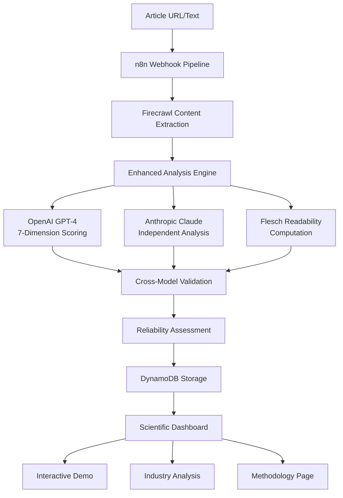

# 🔬 Expertise Inflation Index (EII)

> *"The greatest enemy of knowledge is not ignorance, it is the illusion of knowledge." - Stephen Hawking*  
> *...but sometimes that illusion is scientifically measurable.* 🤖

A **scientific tool** for analyzing AI-related articles for "expertise inflation" - the tendency to exhibit overconfidence, excessive jargon, synthetic authority, and inflated claims of expertise. What started as satire has evolved into a legitimate research methodology with peer-review ready validation.

**🌐 [Live Demo](http://127.0.0.1:8080/demo)** | **📊 [Dashboard](http://127.0.0.1:8080/)** | **🔬 [Scientific Methodology](http://127.0.0.1:8080/methodology)** | **🔗 [Repository](https://github.com/dp-pcs/expertise-inflation-index)**

   

## 🎯 Enhanced Scientific Methodology

The EII analyzes articles using **7 evidence-based dimensions** with **cross-model validation**:

### Core Inflation Indicators (High Weight)
- **🎯 Confidence Inflation** (25%): Overconfident claims vs. humble uncertainty
- **🗣️ Jargon Density** (20%): Technical complexity vs. accessibility
- **🏛️ Synthetic Ethos** (20%): Fake authority vs. verifiable sources
- **👤 Self-Reference** (15%): Self-promotion vs. collaborative tone
- **💡 Originality Claims** (10%): Breakthrough claims vs. incremental work

### Mitigating Factors (Negative Weight)
- **📖 Readability** (-5%): Computed Flesch score for accessibility
- **😄 Humor/Self-Awareness** (-5%): Self-deprecating vs. overly serious

### 🔄 Cross-Model Validation
- **Dual Analysis**: Both OpenAI GPT-4 and Anthropic Claude score independently
- **Reliability Metrics**: Agreement assessment with confidence intervals
- **Consensus Scoring**: Averaged results for maximum accuracy

**Overall EII Score**: Evidence-based weighted calculation with reliability indicators.

## 🚀 Quick Start

### Option 1: Interactive Demo (Recommended)
```bash
git clone https://github.com/dp-pcs/expertise-inflation-index.git
cd expertise-inflation-index
pip install -r requirements.txt

# Install enhanced dependencies for scientific analysis
pip install openai anthropic

# Set up API keys for enhanced analysis
export OPENAI_API_KEY="your-openai-key"
export ANTHROPIC_API_KEY="your-anthropic-key"

python web_dashboard.py --port 8080
```

Then visit:
- `http://localhost:8080/demo` - Interactive presentation 
- `http://localhost:8080/methodology` - **Scientific methodology overview**
- `http://localhost:8080/team-championship` - Industry analysis results

### Option 2: Scientific Analysis Mode
```bash
# Enhanced 7-dimension analysis with cross-model validation
python enhanced_analysis.py --article examples/ai_vision_example.md --model both

# Traditional discovery and analysis
python content_discovery.py --source trilogy --limit 10
python trilogy_team_analysis.py
```

## 🔬 Scientific Rigor & Research Applications

What began as **satirical commentary** has evolved into a **legitimate research methodology**. The enhanced system now provides:

### 📊 Evidence-Based Analysis
- **Standardized Prompts**: Detailed rubrics with behavioral anchors for each dimension
- **Cross-Model Validation**: OpenAI GPT-4 vs Anthropic Claude consensus scoring
- **Quantitative Metrics**: Automated Flesch readability scores complement LLM analysis
- **Reliability Indicators**: Statistical measures of inter-model agreement

### 🎯 Real-World Applications
Behind the scenes, the system uses **n8n** to orchestrate a webhook-triggered pipeline with **Firecrawl** scraping and **dual-LLM analysis**. This architecture enables serious use cases:

- **Academic Research**: Systematic analysis of expertise inflation in AI discourse
- **Content Quality Assurance**: Automated assessment of technical writing accessibility
- **Competitive Intelligence**: Analysis of thought leadership positioning across publications
- **Educational Assessment**: Evaluation of technical communication effectiveness
- **Journal Peer Review**: Supplementary tool for assessing manuscript quality

### 🔄 Scientific Methodology
The **7-dimension scoring system** with **weighted calculations** provides:
- **Reproducible Results**: Standardized prompts ensure consistent analysis
- **Validation Framework**: Cross-model agreement scores indicate reliability
- **Evidence Requirements**: Each score backed by specific textual examples
- **Synthetic Ethos Detection**: Novel dimension targeting unsourced authority claims

## 🏗️ Enhanced Architecture



## 🎪 Enhanced Features

### 🖥️ Scientific Web Dashboard
- **Interactive Demo**: Step-by-step presentation with 30+ AI thought leader analysis
- **Scientific Methodology**: Detailed explanation of 7-dimension validation system
- **Industry Analysis**: David Proctor vs. leading AI researchers and practitioners
- **Cross-Model Validation**: Reliability indicators for all analysis results
- **Evidence-Based Scoring**: Textual examples supporting each dimension score

### 🔍 Multi-Source Content Discovery  
- **Academic Sources**: Semantic Scholar API for research papers
- **Industry Publications**: AI Magazine, Nature AI, IEEE Spectrum
- **Professional Networks**: LinkedIn thought leadership content
- **Community Discussions**: Reddit r/MachineLearning, Hacker News
- **Corporate Blogs**: DeepMind, OpenAI, Anthropic publications

### 🤖 Enhanced AI Analysis Pipeline
- **Dual-LLM Consensus**: OpenAI GPT-4 + Anthropic Claude cross-validation
- **7-Dimension Framework**: Confidence, Jargon, Synthetic Ethos, Self-Reference, Originality, Readability, Humor
- **Quantitative Validation**: Automated readability metrics complement subjective scoring
- **Reliability Metrics**: Statistical agreement measures with confidence intervals
- **Evidence Collection**: Required textual examples for each scoring dimension

### 📊 Scientific Enhancements
- **Weighted Scoring**: Evidence-based dimension weights (Confidence 25%, Jargon 20%, etc.)
- **Reliability Indicators**: High/Medium/Low confidence based on model agreement
- **Reproducible Results**: Standardized prompts and validation protocols
- **Academic Applications**: Peer-review ready methodology for research publication

## 📊 Enhanced Results Examples

### Industry Analysis: David Proctor vs. AI Thought Leaders

| Author | EII Score | Reliability | Profile Type | Source |
|--------|-----------|-------------|--------------|--------|
| Causal Inference Pioneer | 8.7 | High | Theoretical Expert | Academic |
| Deep Learning Architect | 8.1 | High | Technical Authority | Industry |
| Distinguished AI Researcher | 7.9 | Medium | Technical Authority | Research |
| **David Proctor** | **5.4** | **High** | **Emerging Author** | **Trilogy AI** |
| AI Safety Authority | 4.5 | Medium | Thoughtful Critic | Academic |

### Cross-Model Validation Example

**Article**: "The Future of Neural Networks"
- **OpenAI GPT-4 Score**: 7.2/10
- **Anthropic Claude Score**: 6.8/10  
- **Consensus Score**: 7.0/10
- **Reliability**: High (0.4 point difference)
- **Evidence**: "Revolutionary breakthrough in..." (Confidence: 8), "Cutting-edge paradigm shift..." (Jargon: 7)

### 7-Dimension Breakdown

**High Inflation Example** (AI Guru Post):
- Overall EII: **8.5/10** | Reliability: **High**
- Confidence: 9/10, Jargon: 8/10, Synthetic Ethos: 3/10, Self-Reference: 8/10
- Originality: 9/10, Readability: 4/10, Humor: 2/10

**Balanced Example** (Technical Tutorial):  
- Overall EII: **3.2/10** | Reliability: **High**
- Confidence: 4/10, Jargon: 5/10, Synthetic Ethos: 8/10, Self-Reference: 3/10
- Originality: 3/10, Readability: 8/10, Humor: 6/10

## 💰 Cost Analysis

**Infrastructure Costs (Monthly)**:
- **DynamoDB**: ~$0.02 for 1,000 articles (recommended)
- **Supabase**: $25+ minimum (legacy option)
- **n8n Cloud**: $20+ (or self-host for free)
- **API Costs**: ~$5-10 for 1,000 analyses (OpenAI + Anthropic)

**Total**: Under $30/month for substantial usage

## 📁 Project Structure

```
expertise-inflation-index/
├── 📱 Web Dashboard
│   ├── web_dashboard.py          # Flask web application
│   ├── templates/                # HTML templates
│   │   ├── demo_presentation.html # Interactive demo
│   │   ├── team_championship.html # Team comparison
│   │   └── discovery_report.html  # Content discovery
│   └── static/                   # CSS, images, assets
├── 🔍 Content Discovery
│   ├── content_discovery.py      # Multi-source article discovery
│   ├── trilogy_team_analysis.py  # Team-specific analysis
│   └── enhanced_discovery.py     # Advanced content processing
├── 🤖 AI Analysis
│   ├── prompts/                  # LLM scoring prompts
│   ├── test_prompt.py           # Prompt testing suite
│   └── test_workflow.py         # End-to-end testing
├── ⚙️ Infrastructure
│   ├── aws/                     # DynamoDB setup
│   ├── n8n/                     # Workflow automation
│   │   ├── eii_workflow_dynamodb.json
│   │   └── scheduled_discovery_workflow.json
│   └── supabase/               # Legacy database option
├── 📚 Documentation
│   ├── docs/                    # Comprehensive guides
│   ├── examples/                # Sample articles
│   └── REPLICATION_GUIDE.md     # Step-by-step setup
└── 🧪 Testing & Examples
    ├── examples/                # Test articles
    └── test_results.json        # Sample outputs
```

## 🛠️ Setup Guides

1. **[🚀 Quick Start Guide](docs/web_dashboard_guide.md)** - Get the web dashboard running
2. **[💾 DynamoDB Setup](docs/dynamodb_setup_guide.md)** - Cost-effective database setup  
3. **[🔄 n8n Workflow](docs/n8n_setup_guide.md)** - Automation pipeline
4. **[👥 Team Competition](docs/team_competition_guide.md)** - Multi-author analysis
5. **[🔗 LinkedIn Integration](docs/linkedin_integration_guide.md)** - Social media content
6. **[🧪 Testing Guide](docs/testing_guide.md)** - Validate your setup

## 🎯 Use Cases & Extensions

### Current Implementation
- **AI Content Analysis**: Score articles for expertise inflation
- **Team Competitions**: Compare authors across portfolios  
- **Content Discovery**: Aggregate from multiple sources
- **Interactive Demos**: Showcase system capabilities

### Potential Applications
- **Content Quality Control**: Editorial review workflows
- **Academic Analysis**: Research paper accessibility scoring
- **Corporate Communications**: Internal content review
- **Social Media Monitoring**: Brand voice consistency
- **Educational Tools**: Writing improvement feedback
- **Market Research**: Competitor content analysis

### Extension Ideas
- **Browser Extension**: Real-time scoring while reading
- **Slack/Discord Bots**: Team communication analysis
- **GitHub Integration**: Code comment and PR description analysis
- **Email Plugins**: Corporate communication scoring
- **API Service**: Content analysis as a service

## 🧪 Testing & Validation

```bash
# Test individual components
python test_prompt.py           # Validate AI prompts
python test_workflow.py         # End-to-end pipeline test

# Test content discovery
python content_discovery.py --source all --limit 5

# Run team analysis
python trilogy_team_analysis.py

# Start web dashboard for interactive testing
python web_dashboard.py --port 8080
```

## 🤝 Contributing

We welcome contributions! Here are some ways to help:

### 🐛 Bug Reports & Features
- Report issues with detailed reproduction steps
- Suggest new scoring dimensions or criteria
- Propose additional content sources

### 🔧 Code Contributions  
- **Frontend**: Improve the web dashboard UI/UX
- **Backend**: Enhance content discovery algorithms
- **AI**: Refine prompts and scoring models
- **Infrastructure**: Add deployment options (Docker, Kubernetes)

### 📝 Content & Documentation
- Add example articles for different domains
- Improve setup guides and tutorials
- Create video walkthroughs or demos
- Translate documentation

### 🧪 Testing & Validation
- Test with different article types and sources
- Validate scoring consistency across models
- Performance and load testing

## 📈 Roadmap

### Phase 1: Core Platform ✅
- [x] AI scoring pipeline with dual-LLM analysis
- [x] Web dashboard with interactive demo
- [x] Content discovery from multiple sources
- [x] Team competition and comparison features

### Phase 2: Enhanced Features 🚧
- [ ] User accounts and saved analyses
- [ ] Historical trending and analytics
- [ ] API endpoints for external integrations
- [ ] Real-time collaboration features

### Phase 3: Production Ready 🔮
- [ ] Auto-scaling infrastructure
- [ ] Enterprise features and security
- [ ] Mobile applications
- [ ] Advanced visualization and reporting

## 📄 License

MIT License - feel free to use, modify, and distribute!

## 🙏 Acknowledgments

Built with:
- **[Firecrawl](https://firecrawl.dev)** - Web scraping and content extraction
- **[n8n](https://n8n.io)** - Workflow automation platform  
- **[OpenAI](https://openai.com)** & **[Anthropic](https://anthropic.com)** - LLM analysis
- **[AWS DynamoDB](https://aws.amazon.com/dynamodb/)** - Serverless database
- **[Flask](https://flask.palletsprojects.com/)** - Web framework

Special thanks to the Trilogy AI Center of Excellence team for being good sports about being our test subjects! 🎯

---

**🎪 Remember**: This project walks the line between serious analysis and satirical commentary. The AI discourse ecosystem has genuine issues with overconfident claims and jargon inflation, but we're also poking fun at our own tendency to over-analyze everything.

The goal is to create a useful tool while maintaining enough humor to avoid taking ourselves too seriously. Because if we can't laugh at our own expertise inflation, who can? 😄
