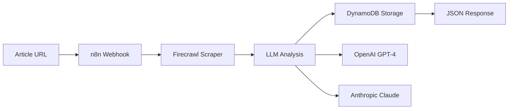

# 🧠 Expertise Inflation Index (EII)

A semi-satirical, semi-scientific open-source project to analyze AI-related articles for "expertise inflation" - the tendency to exhibit overconfidence, excessive jargon, and inflated claims of expertise.

Built using **Firecrawl** (web scraping), **LLMs** (content analysis), **n8n** (workflow automation), and **DynamoDB** (data storage).

🔗 **Repository**: [github.com/dp-pcs/expertise-inflation-index](https://github.com/dp-pcs/expertise-inflation-index)

## 🎯 What It Does

The EII analyzes articles and scores them on five dimensions:

- **Confidence Inflation** (1-10): Overconfident claims vs. humble uncertainty
- **Jargon Density** (1-10): Buzzword usage vs. plain language
- **Self-Reference** (1-10): Self-promotion vs. collaborative tone  
- **Originality Claims** (1-10): Breakthrough claims vs. incremental work
- **Humor/Self-Awareness** (1-10): Self-deprecating vs. overly serious

## 🚀 Quick Start

### 1. Setup Environment

```bash
# Clone repository
git clone https://github.com/dp-pcs/expertise-inflation-index.git
cd expertise-inflation-index

# Install Python dependencies
pip install -r requirements.txt

# Configure API keys (copy and edit)
cp .env.example .env
# Edit .env with your actual API keys
```

### 2. Test the AI Prompt

```bash
# Run the prompt test suite
python test_prompt.py
```

This will test the EII prompt against three example articles and show you how the scoring works.

### 3. Deploy Infrastructure

**Option A: DynamoDB (Recommended - Cost Effective)**
```bash
# Setup AWS DynamoDB
python aws/create_table.py

# Deploy n8n workflow
# Import n8n/eii_workflow_dynamodb.json to n8n
```

**Option B: Supabase (Legacy)**
```bash
# Use supabase/schema.sql and n8n/eii_workflow.json
```

## 📁 Project Structure

```
expertise-inflation-index/
├── prompts/score_prompt.txt     # LLM scoring prompt
├── examples/                    # Sample articles for testing
│   ├── high_inflation_example.md
│   ├── balanced_example.md
│   └── satirical_example.md
├── aws/                         # DynamoDB setup (recommended)
│   ├── dynamodb_schema.json
│   └── create_table.py
├── n8n/                         # Workflow automation
│   ├── eii_workflow_dynamodb.json  # DynamoDB version
│   └── eii_workflow.json           # Supabase version
├── docs/                        # Documentation
├── test_prompt.py               # Prompt testing script
└── test_workflow.py             # End-to-end testing
```

## 🔬 Example Results

**High Inflation Article** (AI guru claiming revolutionary breakthrough):
- Overall EII Score: **8.5/10**
- Confidence: 10/10, Jargon: 9/10, Self-Reference: 9/10, Originality: 9/10, Humor: 1/10

**Balanced Article** (Thoughtful engineering post):
- Overall EII Score: **2.8/10** 
- Confidence: 3/10, Jargon: 4/10, Self-Reference: 2/10, Originality: 2/10, Humor: 3/10

**Satirical Article** (Self-aware meta-commentary):
- Overall EII Score: **4.8/10**
- Confidence: 4/10, Jargon: 6/10, Self-Reference: 5/10, Originality: 5/10, Humor: 9/10

## 💰 Cost Comparison

**DynamoDB vs Supabase:**
- **DynamoDB**: $0.02/month for 1K articles (~99% cheaper!)
- **Supabase**: $25+/month minimum
- **Scaling**: DynamoDB stays cheap, Supabase gets expensive

## 🛠️ Architecture



## 📚 Documentation

- **[DynamoDB Setup Guide](docs/dynamodb_setup_guide.md)** - Cost-effective database setup
- **[n8n Setup Guide](docs/n8n_setup_guide.md)** - Workflow automation
- **[Testing Guide](docs/testing_guide.md)** - Prompt and system testing

## 🎭 Philosophy

This project walks the line between serious analysis and satirical commentary. The AI discourse ecosystem has genuine issues with overconfident claims and jargon inflation, but we're also poking fun at our own tendency to over-analyze everything.

The goal is to create a useful tool while maintaining enough humor to avoid taking ourselves too seriously.

## 🤝 Contributing

This is an open-source project! Contributions welcome:

- **Add example articles**: More test cases across different types
- **Improve the prompt**: Better scoring criteria and instructions
- **Build integrations**: n8n workflows, web scrapers, frontends
- **Create visualizations**: Charts and dashboards for results

## 📊 Future Features

- **Trending analysis**: Weekly expertise inflation trends
- **Author scoring**: Track individual authors over time  
- **Leaderboards**: Top overconfident posts (anonymized)
- **Browser extension**: Real-time scoring while reading
- **Community features**: User submissions and voting

## 📄 License

MIT License - feel free to use, modify, and distribute!

---

*"The greatest enemy of knowledge is not ignorance, it is the illusion of knowledge." - Stephen Hawking*

*...but sometimes that illusion is really, really funny.* 🤖
